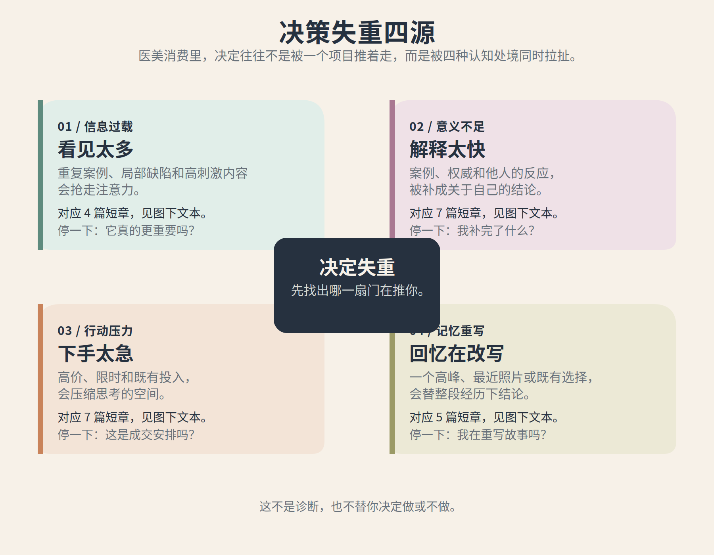
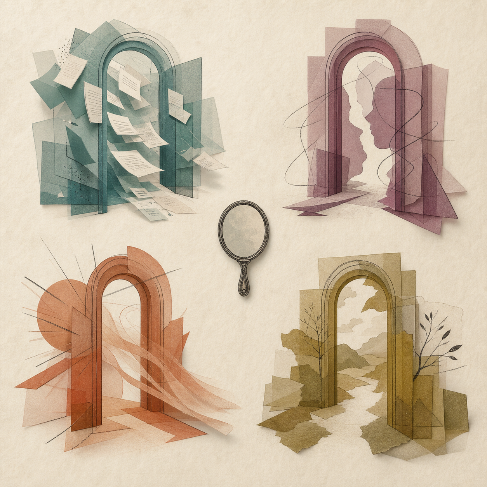
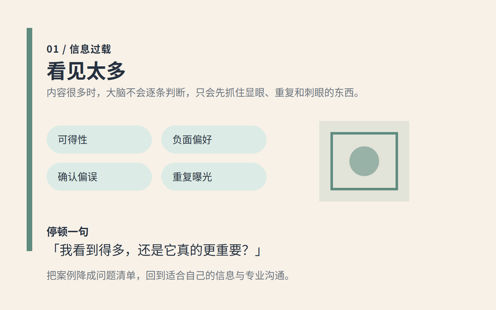
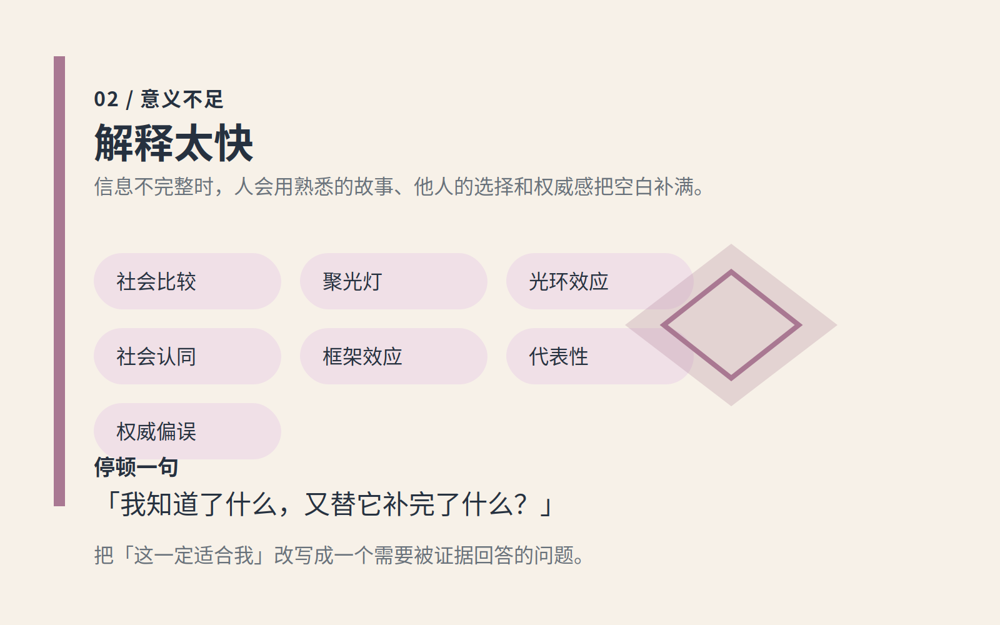
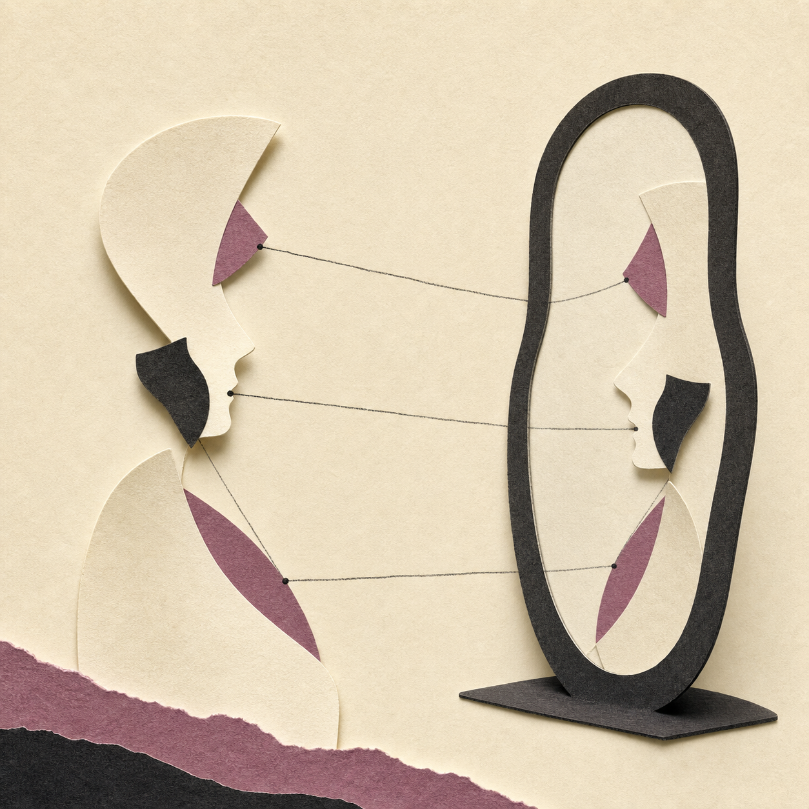
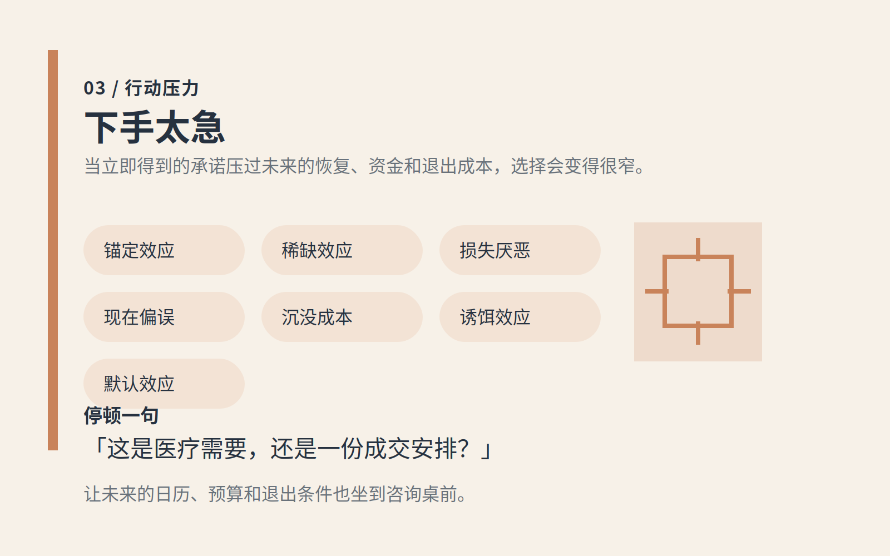
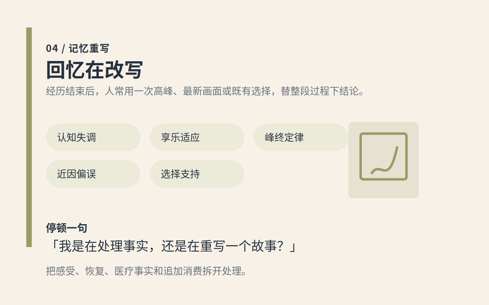

# 决策失重四源：先找出哪一扇门在推你

`ABC` 是按时间走的：先问动机，再识别影响，最后算代价。可人在现实里并不总是按步骤失去判断。有时是刷得太多，有时是解释太快，有时是被催得太急，也有时是在做完后不断改写自己的故事。

这张图提供另一条入口。它不是认知偏误的学术分类，也不是诊断。一个决定可以同时落入几种效应；它只帮你先找到最该停一下的地方。

总图只作概览。请从下面四个可读的文字入口进入：

- [看见太多](#看见太多)：信息太密，显眼和重复抢走了注意力。
- [解释太快](#解释太快)：信息不完整，却已经被补成关于自己的结论。
- [下手太急](#下手太急)：限时、价格和投入，把思考空间挤窄了。
- [回忆在改写](#回忆在改写)：一个高峰、最新画面或既有选择，替过程下了总评。

## 看见太多

当内容不断出现，人很容易把看得多当成更常见、更可靠或更重要。先把屏幕上的刺激降回一个问题，再回到自己的需要。

对应短章：

- [负面偏好：一处小瑕疵，为什么会盖住整张脸](effects/03-负面偏好.md)
- [可得性启发：刷到得多，不等于它更常发生](effects/10-可得性启发.md)
- [确认偏误：你想做时，证据会自动站队](effects/13-确认偏误.md)
- [重复曝光：看得多，会不会就觉得应该做](effects/16-重复曝光.md)

## 解释太快

案例、他人的反应和看起来很可靠的线索，很容易被补成「这就是我的答案」。先把知道的、猜到的和希望的分开。

对应短章：

- [社会比较：别人变美，为什么会变成你的着急](effects/01-社会比较.md)
- [聚光灯效应：你以为所有人都盯着你看](effects/02-聚光灯效应.md)
- [光环效应：一家机构看起来高级，不等于方案适合你](effects/04-光环效应.md)
- [社会认同：别人都做，不等于你该做](effects/07-社会认同.md)
- [框架效应：同一个项目，换种说法就像换了一件事](effects/08-框架效应.md)
- [代表性启发：像你的案例，未必代表你的结果](effects/17-代表性启发.md)
- [权威偏误：白大褂、头衔和奖杯，为什么让人少问两句](effects/18-权威偏误.md)

## 下手太急

高价、限时、折扣和已经花出去的钱，会让人以为自己只有一条路。把每一项拆开，把未来的时间和退出条件也放回桌上。

对应短章：

- [锚定效应：高价先出现，判断就开始跑偏](effects/05-锚定效应.md)
- [稀缺效应：限时不等于该立刻决定](effects/06-稀缺效应.md)
- [损失厌恶：你害怕失去的，未必真属于你](effects/09-损失厌恶.md)
- [现在偏误：今天的镜子，为什么总压过明天的恢复期](effects/11-现在偏误.md)
- [沉没成本：已经花了钱，不是继续花钱的理由](effects/12-沉没成本.md)
- [诱饵效应：那个没人买的套餐，为什么让中间方案突然合理](effects/19-诱饵效应.md)
- [默认效应：已勾选的续购，不等于我重新同意](effects/20-默认效应.md)

## 回忆在改写

最难熬的一天、最新的一张照片，或已经付出的成本，都可能替整段经历说话。感受和事实都重要，但不必立刻把它们变成下一次消费。

对应短章：

- [认知失调：做完之后，别急着替决定辩护](effects/14-认知失调.md)
- [享乐适应：变美以后，为什么快乐没有想象中持久](effects/15-享乐适应.md)
- [峰终定律：一次最难熬的恢复日，为什么会代表整个项目](effects/21-峰终定律.md)
- [近因偏误：最近的一张照片，为什么总像最终判决](effects/22-近因偏误.md)
- [选择支持偏误：选完之后，我们会替自己的选择补好理由](effects/23-选择支持偏误.md)

## 怎么用这张图

在想付款、复购或追加时，不必先找一个能替你拍板的效应。先问：我眼前最明显的问题是信息太多、结论太快、行动太急，还是正在被一段记忆牵着走？选一组短章读完，再回到 [ABC 方法](00-这本手册怎么用.md)。

如果有医疗上的担忧，优先按专业渠道处理；如果只是想立刻追加消费，给事实和情绪各留一点时间。

